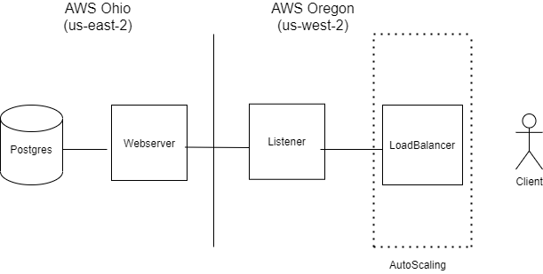

# Computação em Nuvem 

Esse repositório foi criado para o projeto individual final da matéria Computação em Nuvem do Insper (www.insper.edu.br). 

## Projeto: ORM multi-cloud com Load Balancer e Autoscalling

O objetivo do projeto foi criar um sistema ORM multi-cloud com Load Balancer e Autoscalling. Também foi implementada uma comunicação via REST API e o database foi criado em outra região da AWS. Além disso, tem um scrip de implantação e uma aplicação cliente.

### Estrutura

A estrutura esta representada abaixo. Em 'us-west-2' (Oregon) tem o Load Balancer, conectado à um AutoScaling Group e uma instância que conecta a região 'us-east-2' (Ohio), onde está o banco de dados com Postgres. A conexão entre a instância de Ohio é fechada e só pode ser acessada pelo IP da instância de Oregon.



### Comunicação via REST API

Criei um repositório (https://github.com/gicabral/tasks.git) com um RESTful webserver com 4 endpoints, que foi usado na instância de Oregon:
- *GET*: lista todas as tarefas;
- *POST*: adiciona uma tarefa;
- *PUT*: atualiza uma tarefa com um determinado ID;
- *DELETE*: deleta uma tarefa com um determinado ID;

### Como usar

Com o Python 3 instalado, rode esse comando para instalar AWS Command Line Interface e boto3 (AWS SDK para Python):
```bash
$ pip3 install awscli --upgrade --user
$ pip3 install boto3
```

Depois configure suas credenciais AWS:
```bash
$ aws configure
```

Depois rode o scrip nomeado de main.py:
```bash
$ python3 main.py
```
Depois de rodar esses comandos, o scrip vai fazer a limpeza do ambiente e deletar se existir alguma aplicação com o mesmo nome, por exemplo, se no seu ambiente ja existir uma instância com o nome "GI_DB", o script vai terminar essa instância e depois criar outra. Além disso, o script vai criar a instância com o banco de dados em Ohio e vai criar a instância com API em Oregon, além do Load Balancer e AutoScaling. 

### Para usar a aplicação cliente

A aplicação cliente foi feita no arquivo gicli.py utilizando o Click. Os comandos para usar o cliente são os seguintes:

```bash
  $ ./gicli.py listar
  $ ./gicli.py adicionar -t [colocar o titulo] -d [colocar a descrição]
  $ ./gicli.py deletar -id [colocar id da tarefa]
  $ ./gicli.py atualizar -id [colocar id da tarefa] -t [colocar novo título] -d [colocar nova descrição]

```
